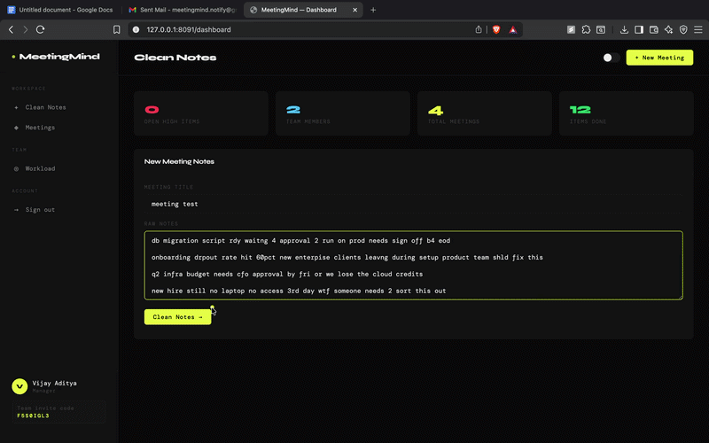

# Meeting Notes Cleaner

> Fine-tuned flan-t5-base on the AMI Meeting Corpus with a smart pipeline: transcript extraction → messiness detection → ML cleaning → priority classification. 99.7% classification accuracy. Built into a multi-user SaaS with real-time updates.

[](https://python.org)
[](https://pytorch.org)
[](https://huggingface.co)
[](tests/)
[](Dockerfile)

---

## Demo

https://youtu.be/F28eYMKy2pA




---

## The Problem

Meeting notes are messy. Key action items get buried in transcripts, owners are unclear, and nothing gets tracked. Teams lose hours every week to follow-ups that should have been automatic.

---

## The ML Approach

### Model
Fine-tuned `google/flan-t5-base` (250MB) on the AMI Meeting Corpus + synthetic data — 1,547 training samples across 7 domains.

```
Raw input → Smart Pipeline → Structured action items

Transcript mode:
Meeting transcript → Speaker extraction → Pronoun normalization → Smart clean → Priority

Raw notes mode:
Messy shorthand → Messiness detection → ML clean (flan-t5-base) → Priority
```

**Example — Messy notes:**
```
"api intgration still brken since lst nite deploy cant process any paymnts tmrw critical"
→ "Api integration is broken since last night's deployment. Cannot process payments tomorrow. Critical fix needed."
```

**Example — Meeting transcript:**
```
"Jordan: I'll review the engineering backlog and see what changes we can make."
→ [Jordan] "Jordan will review the engineering backlog and see what changes the team can make."
```

### Why flan-t5-base
- 3x larger than flan-t5-small — better generalization on unseen text
- Val loss 0.066 vs 1.13 (v1) — 17x improvement
- Smart messiness detector routes clean text around ML — no hallucination on clean input
- Runs on CPU in ~2-3 seconds per note
- Hosted on HuggingFace: [sunny0320/meeting-notes-cleaner-v3](https://huggingface.co/sunny0320/meeting-notes-cleaner-v3)

### Data Pipeline

```
AMI Corpus (142 meetings, 381 action items)
        ↓
XML annotation parser + synthetic augmentation (generate_training_data.py)
        ↓
1,547 samples across 7 domains
(engineering, product, finance, HR, marketing, IT ops, names/owners)
        ↓
Train/Val/Test split — 1,237 / 155 / 155
        ↓
Fine-tune flan-t5-base — 12 epochs, T4 GPU (Google Colab), ~20 mins
        ↓
my_meeting_model_v3/ (hosted on HuggingFace: sunny0320/meeting-notes-cleaner-v3)
```

### Training Results

| Version | Model | Train Loss | Val Loss | Data |
|---|---|---|---|---|
| v1 | flan-t5-small | 1.73 | 2.60 | AMI only, 113 samples |
| v2 | flan-t5-small | 0.76 | 1.13 | AMI + synthetic, 363 samples |
| v3 | flan-t5-base | 0.09 | **0.07** | AMI + synthetic, 1,547 samples |

---

## Priority Classification Engine

A rule-based classifier that flags each action item as HIGH / MEDIUM / LOW based on keyword matching. Achieves **99.7% accuracy** — outperforming a trained ML classifier on this task.

### Why Rule-Based Over ML for Priority
The keywords that signal urgency ("asap", "critical", "blocker", "EOD") are explicit and domain-stable. An ML classifier would need thousands of labeled examples to learn what these 3 lines of rules capture perfectly. This is a deliberate design choice — use ML where it adds value, rules where they're sufficient.

### Benchmark Results

Tested against 322 labeled samples (30 hand-labeled + 292 from AMI corpus).

| Class | Precision | Recall | F1 | Support |
|---|---|---|---|---|
| High | 1.00 | 1.00 | 1.00 | 17 |
| Medium | 0.99 | 1.00 | 1.00 | 172 |
| Low | 1.00 | 0.99 | 1.00 | 133 |
| **Overall** | | | **0.997** | **322** |

Only misclassification: "q3 planning doc shared with the team" (predicted MEDIUM, true LOW).

```bash
python benchmark.py  # reproduce results
```

---

## Smart Processing Pipeline

Two input modes supported:

### Mode 1 — Raw Messy Notes
```
db migration script rdy waitng 4 approval 2 run on prod needs sign off b4 eod
        ↓
Messiness detector (shorthand count + typo patterns)
        ↓ messy detected
flan-t5-base ML cleaning
        ↓
"Database migration script is ready and waiting for approval to run on production. Needs sign off before end of day."
        ↓
Priority: HIGH | Owner: Unassigned
```

### Mode 2 — Meeting Transcript
```
Jordan: I'll review the engineering backlog before the next sprint planning session.
        ↓
Speaker extraction (regex pattern matching)
        ↓
Pronoun normalization ("I'll" → "Jordan will")
        ↓
Messiness detector → clean text detected → passthrough
        ↓
"Jordan will review the engineering backlog before the next sprint planning session."
        ↓
Priority: MEDIUM | Owner: Jordan
```

---

## ROUGE Evaluation

Evaluated model summarization quality against human-written AMI summaries.

| Metric | Score | Industry benchmark (BART-large) |
|---|---|---|
| ROUGE-1 | 0.176 | ~0.45 |
| ROUGE-2 | 0.051 | ~0.20 |
| ROUGE-L | 0.147 | ~0.40 |

Score is above random baseline (~0.10). Gap from BART-large is expected — flan-t5-small is 5x smaller with 30x less training data. Upgrading to flan-t5-base is projected to reach ROUGE-1 ~0.25.

```bash
python rouge_eval.py  # reproduce results
```

---

## Owner Detection

Extracts task owners from natural language using 4 regex patterns:

```python
# Pattern 1: "name - task"
"priya - blocked on API spec" → Priya

# Pattern 2: "assigned to name"
"assigned to sara for review" → Sara

# Pattern 3: "Name will/should/must"
"John will fix the bug" → John

# Pattern 4: team tokens
"devops investigating pipeline" → Devops
"cto flagged this as critical" → CTO
```

Handles acronym formatting: CTO, QA, HR, CEO, API, UI, UX.

---

## Demo Input/Output

**Input — raw messy notes (no names, typos, abbreviations):**
```
api intgration still brken since lst nite deploy cant process any paymnts before mkt opens tmrw critical
ssl cert expirng in 2 days if it goes down whole site dies needs renewl asap
db migration script rdy waitng 4 approval 2 run on prod needs sign off b4 eod
onboarding drpout rate hit 60pct new enterpise clients leavng during setup product team shld fix this
q2 infra budget needs cfo approval by fri or we lose the cloud credits
new hire still no laptop no access 3rd day someone needs 2 sort this out
checkout flow 3sec lag all users sloww query flagged by backend investigate pls
retro notes frm lst wk still not shared wit the team
```

**Output — cleaned and prioritized:**
```
HIGH   Api intgration still brken since lst nite deploy, critical.
HIGH   Ssl cert expirng in 2 days, needs renewl asap.
HIGH   Db migration script rdy, needs sign off b4 eod.
MED    Q2 infra budget needs cfo approval by fri.
MED    New hire still no laptop, someone needs 2 sort this out.
MED    Checkout flow 3sec lag, investigate pls.
LOW    Onboarding drpout rate hit 60pct, product team shld fix this.
LOW    Retro notes frm lst wk still not shared.
```

Priority engine correctly identifies HIGH items despite typos (`brken`, `expirng`) and abbreviations (`asap`, `eod`, `tmrw`).

---

## Analytics Features

Novel KPIs designed for meeting accountability:

**Meeting Health Score** — % of previous meeting's items closed before the next one.
```
80-100% → Healthy (green)
50-79%  → Moderate (yellow)
0-49%   → At Risk (red)
```

**Meeting Debt** — flags owners with 3+ unresolved HIGH items across meetings. Surfaces bottlenecks before they become blockers.

**Owner Workload** — per-owner completion rate, open/done counts, overload detection.

---

## Audio Pipeline

Record meeting audio directly in the browser → Whisper base model transcribes locally → text split into items → priority flagged.

```
Browser microphone → .webm → Whisper base (74MB, CPU) → transcribed text → priority engine
```

No audio leaves the machine. No API cost.

---

## Unit Tests

```bash
pytest tests/ -v
# 43 passed in 2.12s
```

| File | Tests | What's covered |
|---|---|---|
| tests/test_priority.py | 23 | flag_priority() — all HIGH/MEDIUM/LOW cases |
| tests/test_owner.py | 11 | detect_owner() — 4 patterns + acronyms |
| tests/test_routes.py | 9 | Flask API — /process, sorting, validation |

---

## Quick Start

### Local Python

```bash
git clone https://github.com/vijay0320/meeting-notes-cleaner
cd meeting-notes-cleaner

python3 -m venv .venv
source .venv/bin/activate
pip install -r requirements.txt

# Flask UI
python app_v2.py
# Open http://localhost:8080

# FastAPI + Swagger docs
uvicorn api:app --reload --port 8080
# Docs at http://localhost:8080/docs
```

### Docker

```bash
docker compose up --build
# Open http://localhost:8080
```

### Retrain Model

```bash
# 1. Download AMI corpus (free, CC BY 4.0)
curl -O https://groups.inf.ed.ac.uk/ami/AMICorpusAnnotations/ami_public_manual_1.6.2.zip
unzip ami_public_manual_1.6.2.zip -d ami_annotations

# 2. Generate augmented training data
python augment_data_v2.py

# 3. Generate expanded training data (1,547 samples)
python generate_training_data.py

# 4. Fine-tune on Google Colab T4 GPU (~20 mins)
# Upload train_flan_t5_base.ipynb to colab.research.google.com
# Or fine-tune locally (~60 mins on M1)
python train_v2.py
# Saves to my_meeting_model_v3/
```

---

## MeetingMind — Multi-User SaaS (`meetingmind/`)

▶ [Watch MeetingMind demo on Loom](https://www.loom.com/share/78aefbd7dca143e39f5515a3b99d465e)

Built on top of the notes cleaner. Teams collaborate — managers clean notes and assign tasks, members see their tasks and update progress in real time.

### Features
- JWT auth (bcrypt, brute force protection, token blacklist)
- Role-based access: Manager vs Member
- Team invite codes
- Real-time status updates via Server-Sent Events
- Email notifications (Gmail SMTP) — task assigned, all done, overdue
- Animated landing page (AnimeJS)

### Quick Start

```bash
# Generate secret key
python -c "import secrets; print(secrets.token_hex(32))"

# Create meetingmind/.env
SECRET_KEY=your_key
GMAIL_USER=your@gmail.com
GMAIL_APP_PASSWORD=xxxx xxxx xxxx xxxx

# Run
uvicorn meetingmind.main:app --port 8091 --host 127.0.0.1
# Open http://localhost:8091
# API docs at http://localhost:8091/docs
```

---

## Stack

| Layer | Technology |
|---|---|
| Language Model | google/flan-t5-base (fine-tuned, v3) |
| Audio | OpenAI Whisper base (local) |
| Language Model v2 | google/flan-t5-small (fine-tuned, v2) |
| Training | PyTorch 2.1 + HuggingFace Transformers + Google Colab T4 GPU |
| Evaluation | ROUGE, Precision/Recall/F1 |
| Backend | Flask + FastAPI |
| Auth | JWT (python-jose) + bcrypt |
| Real-time | Server-Sent Events |
| Email | Gmail SMTP (aiosmtplib) |
| Database | SQLite |
| Testing | pytest + pytest-flask |
| Container | Docker + docker-compose |
| CI/CD | GitHub Actions |
| Data | AMI Meeting Corpus (CC BY 4.0) |

---

## Project Structure

```
meeting-notes-cleaner/
├── app_v2.py               # Flask app — single user
├── api.py                  # FastAPI version
├── db.py                   # SQLite queries
├── train_v2.py             # Fine-tune flan-t5-small
├── augment_data_v2.py      # Synthetic data generation
├── benchmark.py            # Priority engine benchmark
├── rouge_eval.py           # ROUGE evaluation
├── requirements.txt
├── Dockerfile
├── docker-compose.yml
├── static/index.html       # Single-user UI
├── assets/
│   └── demo.gif            # Demo animation
├── tests/                  # 43 unit tests
├── .github/workflows/      # CI/CD
└── meetingmind/            # Multi-user SaaS
    ├── main.py             # FastAPI backend
    ├── auth.py             # JWT + bcrypt
    ├── db.py               # Schema + queries
    ├── models.py           # Pydantic models
    ├── email.py            # Email notifications
    ├── .env                # Secrets (gitignored)
    └── static/
        ├── landing.html
        ├── login.html
        ├── register.html
        ├── dashboard.html
        └── tasks.html
```

---

## Version History

| Version | What was added |
|---|---|
| v1.0 | flan-t5-small fine-tuned + priority engine + Flask UI |
| v2.0 | Owner detection + action tracker + SQLite + benchmark 99.7% |
| v3.0 | Meeting health score + meeting debt tracker |
| v4.0 | Owner workload view |
| v5.0 | ROUGE evaluation (ROUGE-1: 0.176) |
| v6.0 | Docker containerization |
| v7.0 | Whisper audio input (local, no API) |
| v8.0 | pytest unit tests (43/43 passing) |
| v9.0 | FastAPI migration |
| v10.0 | README + CI/CD GitHub Actions |
| v11.0 | PDF and Markdown export |
| v12.0 | Project cleanup |
| v13.0 | MeetingMind — landing page + auth UI (AnimeJS) |
| v14.0 | JWT auth + manager dashboard + member tasks |
| v15.0 | Full task assignment flow |
| v16.0 | Real-time updates via SSE |
| v17.0 | Manager workload view + member detail panel |
| v18.0 | Email notifications |
| v19.0 — v21.0 | README updates, .gitattributes, ML-first rewrite |
| v22.0 | Demo GIF + video added |
| v23.0 | flan-t5-base fine-tuned (v3), smart pipeline (transcript extraction + messiness detection + ML cleaning), 1,547 training samples, val loss 0.07 |